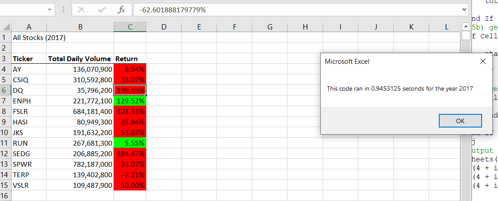

# stock_analysis
Analyze Stock Data with VBA
### Folder: stock_analysis
## Overview of Project
This project allows you to test VBA skills that is covered in Module 2 with using refactoring. This project includes the entire stock market over the last few years to analyse stock market for user chosen years of stock market data using VBA skills. By doing this you must use refactoring technic. You should make your code more readable, efficient and should use less memory and run time.

## Results
In the original module code it takes 0.9453 seconds to create the volume table for each ticker using 2017 data but in the refactored vbs code it takes 0.1210 seconds to create the volume table for each ticker using 2017 data. It runs faster with the vb script code; about 0.8243 seconds faster.
This image shows the result of the refactoring table for the 2017 data

This image shows the result of the refactoring table runtime in seconds for the 2017 data

The following image shows the result of the refactoring table runtime in seconds for the 2017 original data using module 2 study code

In the original module code it takes 0.9726 seconds to create the volume table for each ticker using 2018 data but in the refactored vbs code it takes 0.1171 seconds to create the volume table for each ticker using 2018 data.It runs faster with the vb script code; about 0.8555 seconds faster for the 2018 data.

This image shows the result of the refactoring table and runtime in seconds calculated for the 2018 data

This image shows the result of the refactoring table runtime in seconds for the 2018 data

The following image shows the result of the refactoring table runtime in seconds for the 2018 original data using module 2 study code

The below images show the refactored code in vb script file. As you can see the comments are in place to explain the code. Initializations done correctly and loop counters and arrays are set to store first and last close values for each ticker which in the end saves us runtime.
Refactored code sample1:

Refactored code sample2:

You can find very good information on [Refactoring Process and Techniques ](https://refactoring.guru/refactoring) to learn it.

## Summery

- Code refactoring disadvantages are in general that it is very time consuming, migth have to retest many functionalities and you can make mistakes and break the product while refactoring existing code. 
Code refactoring advantages are in general that refactoring makes the code more efficient, readable, increases the quality of your design, quality of your code, makes it less complex and eaiser to understand, reduces run time and uses less memory.
- Advantages/ disadvantages of the refactored VBA script:
Disadvantages of the refactored VBA script that it was time consuming and I broke the code many times by misinterpreting the steps while refactoring loops/conditions to make it more efficient.
Advantages of the refactored VBA script is that the code is cleaner, more readable, more efficient and better quality code and it took less time to run the code, meaning it reduces the run time and used less memory. 
In the original module code it took 0.9453 seconds to create the volume table for each ticker using 2017 data but in the refactored vbs code it took 0.1210 seconds to create the volume table for each ticker using 2017 data. Refactoring has the advantage of running it .8243 seconds faster.
In the original module code it took 0.9726 seconds to create the volume table for each ticker using 2018 data but in the refactored vbs code it took 0.1171 seconds to create the volume table for each ticker using 2018 data.Refactoring has the advantage of running it .8555 seconds faster.